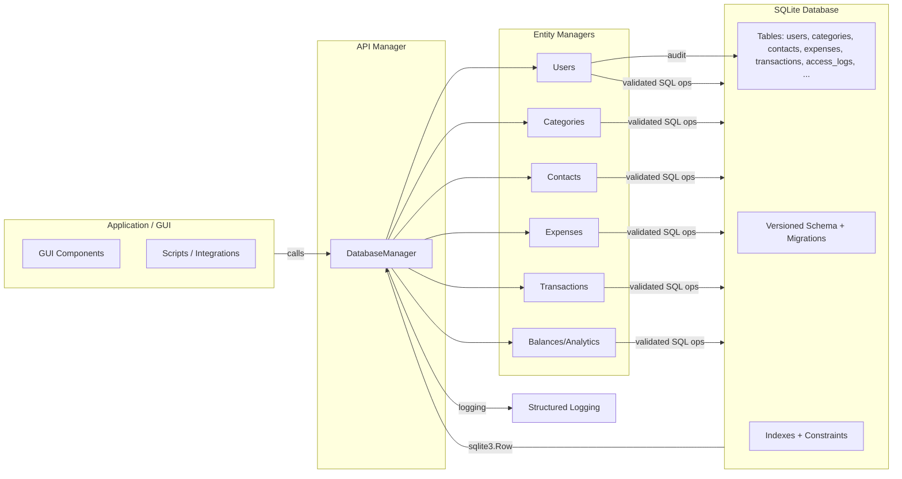

# Python project template

A simple template of a Python project, with a rigid file structure, and predisposition for unit testing and release on PyPi.

## Relevant features

- All your project code into a single main package (`MoneyMate/`)
- All your project tests into a single test package (`test/`)
- Unit testing support via [`unittest`](https://docs.python.org/3/library/unittest.html)
- Automatic testing on all branches via GitHub Actions
- Semi-automatic versioning via Git
- Packaging support via [`setuptools`](https://setuptools.pypa.io/en/latest/setuptools.html)
- Automatic release on [PyPi](https://pypi.org/) via GitHub Actions
- Docker image support via `Dockerfile`
- Automatic release on [DockerHub](https://hub.docker.com/) via GitHub Actions
- Support for semi-automatic development environment management via [Pyenv](https://github.com/pyenv/pyenv)
- Automatic dependencies updates via [Renovate](https://docs.renovatebot.com/)
- Automatic conversion of `TODO` comments into GitHub issues via the `alstr/todo-to-issue-action`

## Project structure 


```text
.
├── src/
│   └── moneymate/
│       ├── __init__.py
│       ├── __main__.py
│       ├── cli.py
│       ├── data/
│       │   ├── __init__.py
│       │   └── database.py
│       ├── models/
│       ├── services/
│       ├── config/
│       └── utils/
├── MoneyMate/
│   ├── __init__.py
│   └── __main__.py
├── tests/
│   ├── unit/
│   │   └── test_data_layer.py
│   ├── integration/
│   └── conftest.py
├── sql/
├── scripts/
├── pyproject.toml
├── README.md
├── LICENSE
├── CHANGELOG.md
├── .github/
│   └── workflows/
│       ├── ci.yml
│       └── release.yml
├── renovate.json
└── .gitignore
```
artifact/
├─ MoneyMate/
│  ├─ __init__.py
│  ├─ data_layer/
│  │  ├─ __init__.py
│  │  ├─ database.py           # Low-level DB connection, schema, migration baseline
│  │  ├─ manager.py            # Process-wide API manager, orchestrates sub-managers
│  │  ├─ users.py              # Registration, login/logout, roles, password mgmt
│  │  ├─ categories.py         # CRUD for categories, ownership checks
│  │  ├─ contacts.py           # CRUD for contacts
│  │  ├─ expenses.py           # CRUD, search, deterministic listing, pagination
│  │  ├─ transactions.py       # CRUD, deterministic listing, pagination
│  │  ├─ balances.py           # Net balance and per-contact summaries
│  │  ├─ logging_utils.py      # Structured logging helpers
│  │  └─ utils.py              # Shared utilities, validators
│  │
│  └─ gui/                     
│     ├─ __init__.py
│     ├─ app.py                # GUI entry-point 
│     └─ ...                   # Views, controllers, assets
│
├─ tests/                      # test subdivided by category
│  ├─ data_layer/
│  ├─ gui/                     
│  ├─ system/
│                        
├─ .github/
│  └─ workflows/
│                
├─ LICENSE
├─ README.md
├─ pyproject.toml              
├─ requirements.txt
└─ requirements-dev.txt        # Includes pytest (per CI notes)
```

## Flow Chart (architecture)



## Acknowledgements

- Maintainers and contributors:
  - [Andrea Giovanardi](https://github.com/andreito0012)
  - [Cristian Romeo](https://github.com/CristianRomeo)
  - [Matteo Fabbri](https://github.com/FebaRindo)

## License

MIT License. See [LICENSE](./LICENSE).
