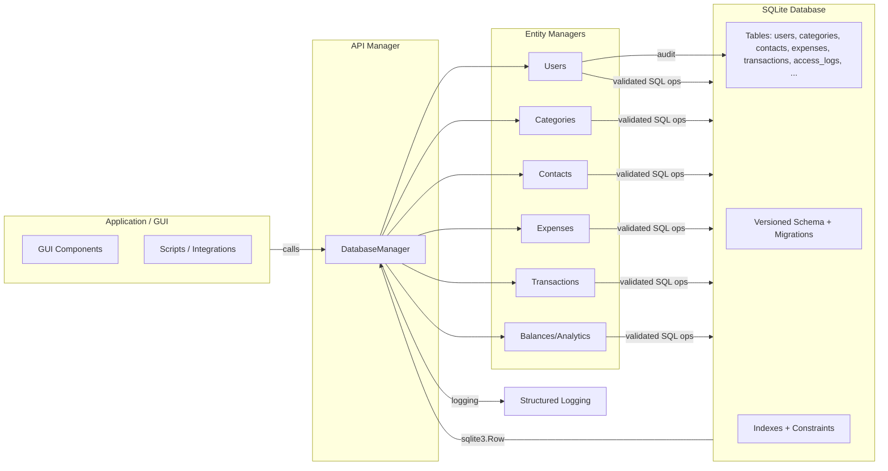

# MoneyMate

MoneyMate is a Python-based data layer and application toolkit for personal finance management. It provides a thread-safe, versioned SQLite backend with entity managers for users, categories, contacts, expenses, and transactions. It includes authentication with roles (user/admin), auditing of access events, deterministic listings with pagination and filtering, balance analytics, and structured logging. This repository also provide a Tkinter GUI (with matplotlib charts) built on the same backend.

## Overview

MoneyMate offers a modular, testable data layer designed to be embedded in applications or used from scripts. Its architecture centers on:
- A process-wide, thread-safe API manager wrapping a versioned SQLite database
- Entity-specific managers handling CRUD with strict validation and consistent semantics
- Deterministic listings to make UI and testing predictable
- Optional GUI features (branch: gui), integrating with the same API layer
- Packaging and CI/release automation to distribute wheels and source archives

## Features

- Thread-safe API manager with safe database path switching
- Authentication and roles
  - User registration, login/logout
  - Role management (user/admin)
  - Admin registration policy (academic/testing only)
- Auditing
  - Best-effort access logs for login/logout, failed_login, password_change, password_reset
- Deterministic listings and search
  - Expenses/Transactions: ordered by date DESC, id DESC
  - Contacts/Categories: ordered by name ASC
  - Case-insensitive expense search by title/category
- Pagination and filtering
  - limit, offset for listings
  - date_from, date_to for time-bounded queries
- Categories and expenses semantics
  - No hard DB foreign key on expenses.category_id
  - Ownership enforced in application logic
  - category_id preserved after category deletion (per tests/specs)
- CRUD semantics
  - Partial updates with patch-like behavior
  - Idempotent deletes with explicit deleted counts
- Balances and analytics
  - Net balance calculation
  - Per-contact balance summaries from sender perspective
  - Detailed breakdowns for analytics
- Database and schema
  - Versioned schema baseline and non-destructive migration scaffold
  - Constraints and indexes for integrity/performance
  - sqlite3.Row factory, WAL + synchronous=NORMAL best-effort tuning
- Logging and observability
  - Structured, consistent logging across modules
  - Root logging opt-in via MONEYMATE_CONFIGURE_LOGGING
- Tests
  - pytest-based test suite


## Repository Structure

Top-level:
```
artifact/
├─ MoneyMate/
│  ├─ __init__.py
│  ├─ data_layer/
│  │  ├─ __init__.py
│  │  ├─ database.py           # Low-level DB connection, schema, migration baseline
│  │  ├─ manager.py            # Process-wide API manager, orchestrates sub-managers
│  │  ├─ users.py              # Registration, login/logout, roles, password mgmt
│  │  ├─ categories.py         # CRUD for categories, ownership checks
│  │  ├─ contacts.py           # CRUD for contacts
│  │  ├─ expenses.py           # CRUD, search, deterministic listing, pagination
│  │  ├─ transactions.py       # CRUD, deterministic listing, pagination
│  │  ├─ balances.py           # Net balance and per-contact summaries
│  │  ├─ logging_utils.py      # Structured logging helpers (naming illustrative)
│  │  └─ utils.py              # Shared utilities, validators
│  │
│  └─ gui/                     # GUI components (present on the gui branch)
│     ├─ __init__.py
│     ├─ app.py                # GUI entry-point (naming illustrative)
│     └─ ...                   # Views, controllers, assets
│
├─ tests/                      # test subdivided by category
│  ├─ data_layer/
│  ├─ gui/                     
│  ├─ system/
│                        
├─ .github/
│  └─ workflows/
│                
├─ LICENSE
├─ README.md
├─ pyproject.toml              
├─ requirements.txt
└─ requirements-dev.txt        # Includes pytest (per CI notes)
```

## Flow Chart (architecture)



## Acknowledgements

- Maintainers and contributors:
  - [Andrea Giovanardi](https://github.com/andreito0012)
  - [Cristian Romeo](https://github.com/CristianRomeo)
  - [Matteo Fabbri](https://github.com/FebaRindo)

## License

MIT License. See [LICENSE](./LICENSE).
